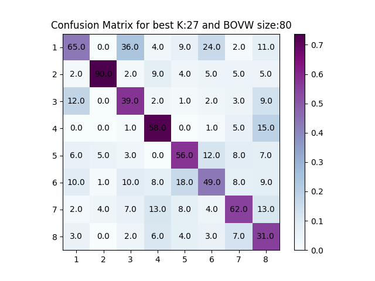

# Q1 Report

## Usage

```python
usage: Q1.py [-h] [--mode {1,2,3,4}] [--k K] [--kmeans_cluster KMEANS_CLUSTER]
             [--train_data_path TRAIN_DATA_PATH]
             [--test_data_path TEST_DATA_PATH]
             [--train_label_path TRAIN_LABEL_PATH]
             [--test_label_path TEST_LABEL_PATH] [--confusion {0,1}]

Classification Using Knn and Bag Of Visual Words

optional arguments:
  -h, --help            show this help message and exit
  --mode {1,2,3,4}      Mode for running code: 1)Kmeans bag of words
                        Generation and feature Generation 2)Cross validation
                        in Kfolds 3)Classification using KNN 4)Cross
                        Validation and Classification with KNN results
  --k K                 K for KMeans, KNN or Kfolds (compulsary)
  --kmeans_cluster KMEANS_CLUSTER
                        Path cluster pkl file
  --train_data_path TRAIN_DATA_PATH
                        Path to train folder/pkl
  --test_data_path TEST_DATA_PATH
                        Path to test folder/pkl
  --train_label_path TRAIN_LABEL_PATH
                        Path to train label file/pkl
  --test_label_path TEST_LABEL_PATH
                        Path to test labels file/pkl
  --confusion {0,1}     plot confusion matrix
```

## Results
Best BOVW size/ Number of clusters : 80<br>
Best `K` value (using **5** fold cross-validation): 15<br>
Best Accuracy: **56.44555694618273%**

## Stats
Number of Clusters | Best K value (cross validation) | Accuracy
--- | --- | ---
10 | 37 | 43.42928660826033%
20 | 23 | 50.6883604505632%
30 | 41 | 50.31289111389236%
40 | 15 | 53.81727158948686%
50 | 13 | 52.5657071339174%
60 | 27 | 53.191489361702125%
70 | 43 | 54.31789737171464%
**80** | **27** | **56.32040050062578%**
90 | 27 | 55.694618272841055%
100 | 35 | 54.31789737171464%

## Best Confusion Matrix

