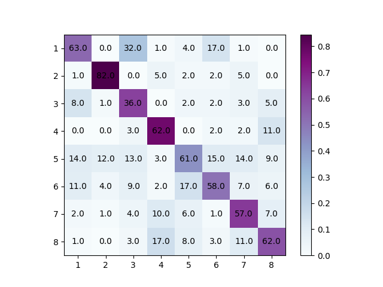

## CV Assignment - 2
### Q2 Report

***
#### How to run:
```python
python3 Q2.py
```
#### Result:
Best Accuracy: **60.125%**


#### Conditions:
```
1. random_state = 0
2. Outlier C = 0.001
3. max_iter = 10000
4. Tolerance tol = 0.01
```
#### Stats:<br>

Number of Clusters | Accuracy
--- | --- 
10 | 40.25%
20 | 50.375%
30 | 50.125%
40 | 54.25%
50 | 53.75%
60 | 53.375%
70 | 57.125%
80 | 56.75%
90 | 58.625%
**100** | **60.125%**

#### Confusion Matrix Image:


