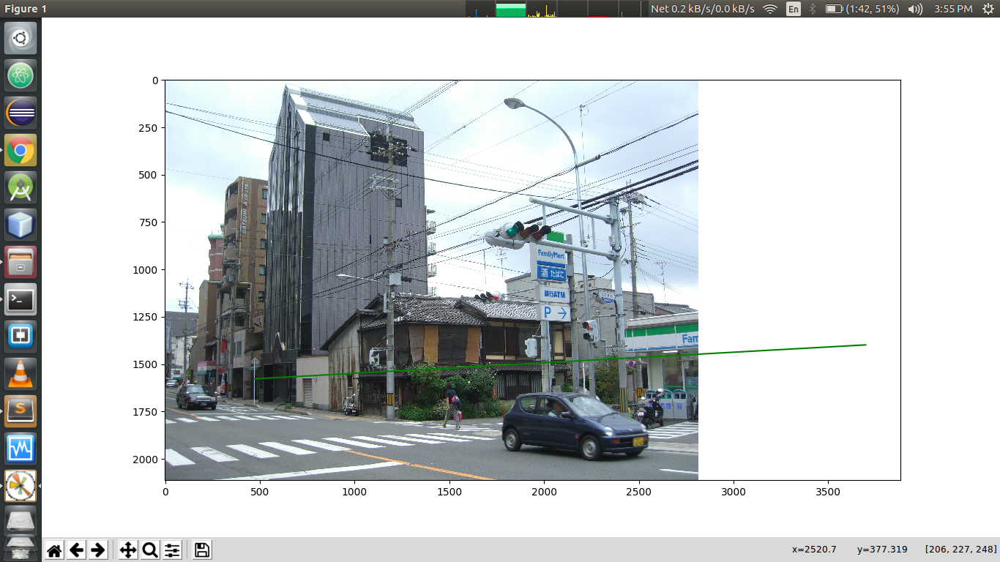

# Q1: Vanishing Points

## Installing Dependencies

1. First create Python3 Virtual Environment by executing ```virtualenv -p python3 env```.
2. Then, activate the environment by typing ```source env/bin/activate```.
3. Finally run ```pip install opencv-python matplotlib numpy Pillow```.

## How to Execute

1. Change the image path at this [line](https://github.com/radonys/CV-Assignments/blob/a53a7ff8fa51f4234033b9e9cb2d1b6fec61965f/Assignment-3/Q1/1.py#L143) of the code with the path of your given input image.
2. Then plot 3 pairs of parallel lines in the image to obtain a vanishing point.
3. Repeat Step 2 for second vanishing point and then a vanishing line is obtained.

## Results

Results are computed for image:


The results are shown below:


