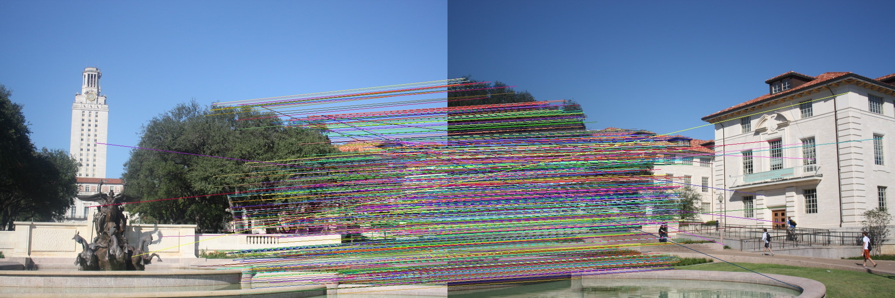
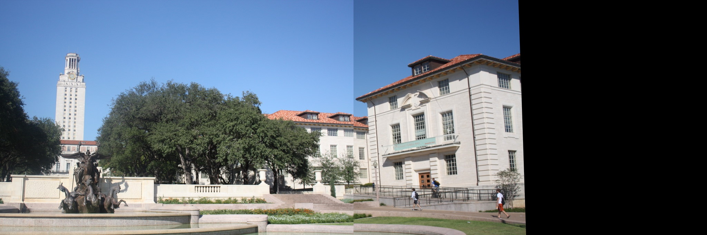

# Q3: Image Stitching
#### Usage:
```bash
$ python Q3.py
```
### Note:
- The program assumes `uttower_right.jpg` and `uttower_left.jpg` are in the same folder.
- It has Thresholds hardcoded in it. Please change according to your needs for any modification.
- As the program uses SIFT descriptor, the original cv2 won't have this (SIFT is proprietary). To run the code, uninstall cv2 using
```
pip uninstall opencv-python
```
and install `opencv-python-contrib` by running
```
pip install opencv-python-contrib
```

### Report
First the SIFT descriptor matches are found based on the Nearest Neighbour with a threshold distance as mentioned in [David Lowe's Paper](https://people.eecs.berkeley.edu/~malik/cs294/lowe-ijcv04.pdf)


The Homography Matrix is selected using RANSAC and DLT, which selects the matrix which projects the maximum number of matches within a threhold.
This generates a warped image in the final image plane using the found Homography.


The Left image is overwritten in the warped image (no blending used)


As RANSAC is used, this might not generate same images every time, But will have decent merged images.
